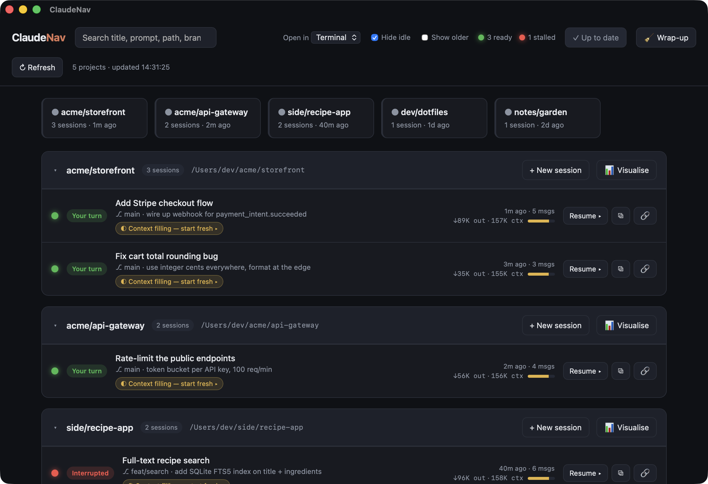

# ClaudeNav

A local navigator for your Claude Code sessions. See every session grouped by
project, spot which terminals are **live right now**, read a one-line summary of
each, and jump back in — or start a fresh session — with one click.



## Why

If you keep many terminals open running Claude Code, it's easy to lose track of
which one is doing what. ClaudeNav reads the session transcripts Claude Code
already writes to `~/.claude/projects/` and turns them into a browsable
dashboard.

## Run

```bash
node server.js
# then open http://127.0.0.1:4317
```

No dependencies, no build step. Requires Node 18+ and macOS (for opening
terminals via AppleScript). Binds to `127.0.0.1` only.

Change the port with `PORT=5000 node server.js`.

## What it shows

- **Projects** grouped by working directory, live ones first.
- **Live terminals** — detected from running `claude` CLI processes and their
  working directories. A green dot marks sessions likely open in a terminal now.
- For each session: the auto-generated **title**, the **last prompt**, git
  branch, message count, and time since last activity.
- A **search** box that filters across title, last prompt, path, and branch.

- **Active-folder cards** at the top — one per folder that has a live terminal,
  as quick jump links to that project's sessions.

### Traffic-light status

Every session shows a colored light at a glance:

- 🟡 **amber, pulsing** — working (a turn is in progress)
- 🟢 **green** — ready / your turn (waiting for input)
- 🔴 **red** — interrupted (stopped mid-work, stale)
- ⚪ **grey** — idle (dormant)

The header shows running totals. In the chat panel a large light flips amber
while Claude works and green when it's ready — and when a turn finishes the
browser tab title flashes "🟢 Ready" and the favicon turns green, so you notice
even with the tab in the background (it stops flashing when you focus the tab).

## Actions

- **Resume ▸** — opens a new Terminal (or iTerm) window running
  `claude --resume <session-id>` in that project's directory.
- **+ New session** — opens a terminal and starts a fresh `claude` in that
  project directory.
- **⧉** — copies the `claude --resume …` command to your clipboard instead of
  opening a window.

Pick **Terminal** or **iTerm** from the dropdown in the header.

## Chat with a session from the browser

Click any session row to open a conversation panel that **live-tails the
transcript** and lets you **chat with that session without leaving the browser**.

When you send a message, the server runs `claude --resume <id> -p "<text>"` in
the session's working directory. That continues the *same* session — it keeps
the full context and appends to the same transcript file — and the reply shows
up in the panel as it's written. No terminal involved.

Replies render as **Markdown** (code blocks, lists, inline code, links).

### Pasting images

Paste an image into the composer (⌘V), drag-drop a file, or click 📎. Thumbnails
appear above the box; send and they're written to `~/.claude/claudenav-uploads/`
and referenced in the prompt by path, so Claude reads them with its Read tool.
Attached images render inline in the transcript.

- Works for **any** session, live or not.
- A "⏳ Claude is working…" indicator shows while a turn runs, with a queued
  count if you've lined up more.
- **Send as many as you like** — turns for one session run one-at-a-time in the
  order you sent them, so the transcript never gets two browser writers at once.
- A hung turn is stopped after a timeout (`CLAUDE_TURN_TIMEOUT_MS`, default 15
  min) and in-flight turns are killed when the server stops.

### Using the browser and a terminal together

This is safe. Each browser turn re-reads the session from disk before
continuing, so it always picks up anything you typed in the terminal. Partial
lines from a concurrent write are skipped and re-read on the next poll. The one
thing the browser can't do is update the terminal's *in-memory* view — the
terminal won't show turns you ran from the browser until you reopen the session
there. The panel notes when a session is also open in a terminal.

> **Permissions:** turns run with `--dangerously-skip-permissions` so the
> assistant can actually use tools, matching how these sessions were started.
> Set `CLAUDE_SAFE=1` to drop that flag. Set `CLAUDE_BIN` if `claude` isn't on
> the server's PATH.

## How it works

Each session is a `~/.claude/projects/<encoded-cwd>/<session-id>.jsonl` file.
The server parses each file for the `ai-title`, `last-prompt`, `cwd`,
`gitBranch`, and timestamps, caches results by file mtime, and detects live
terminals with `ps` + `lsof`. The page auto-refreshes every 5 seconds.

## Notes / limitations

- Live detection maps a running `claude` process to its working directory. When
  several terminals share one directory, ClaudeNav marks the *N* most recently
  active sessions in that directory as live (where *N* = number of live
  terminals there) — it can't always pin a process to one exact session.
- Opening terminals uses AppleScript, so it's macOS-only. Other platforms still
  get the full read-only dashboard and the copy-command button.
